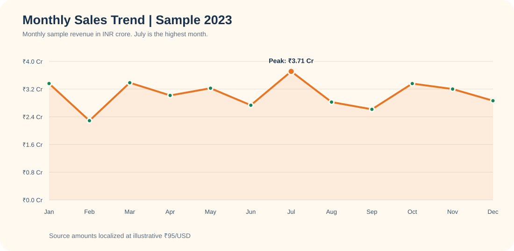
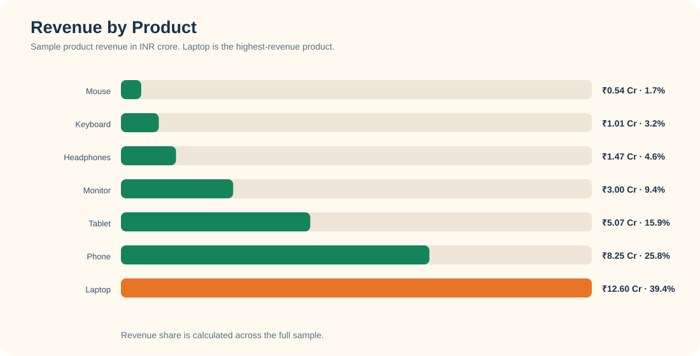
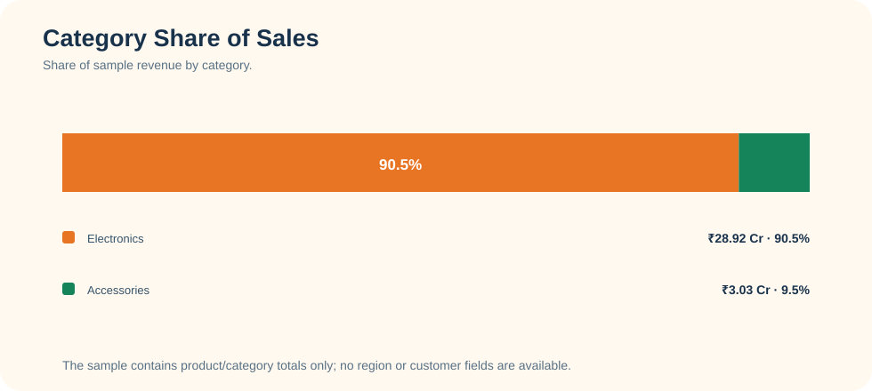

# India-Localized Retail Sales Analysis

An end-to-end Python and pandas portfolio project that audits a sample retail sales dataset, checks its revenue calculations, and explores product, category, and monthly performance. The presentation localizes the source's dollar-denominated amounts to Indian rupees and uses an India-inspired saffron, cream, green, and navy visual palette.

> **Data and currency note:** The source repository labels monetary values with `$`. This project converts those sample values using a fixed illustrative rate of **₹83 per US dollar**. It is a presentation assumption, not a historical exchange rate or evidence that these transactions occurred in India. The dataset has no customer, city, or state fields, so the analysis does not make customer or regional claims.

## Highlights

- Audits **3,481 order records** across January–December 2023.
- Checks missing values, exact duplicates, unique order IDs, positive quantities/prices, valid dates, and `TotalSales = Quantity × UnitPrice`.
- Analyzes revenue by product, category, and month, plus average order value and units per order.
- Generates three charts in `visuals/` with INR labels and Indian number units (lakh/crore).

## Findings from the sample

| Measure | Result |
| --- | ---: |
| Sample orders | 3,481 |
| Total sample sales | ₹31.96 crore |
| Average order value | ₹91,798.33 |
| Average units per order | 2.49 |
| Top product by revenue | Laptop — ₹12.60 crore (39.4% of sales) |
| Top category | Electronics — ₹28.92 crore (90.5% of sales) |
| Highest month | July — ₹3.24 crore |
| Lowest month | February — ₹2.00 crore |

These are descriptive results from the provided sample. July is the highest month in the data; the analysis does not infer why it peaked.

## Charts







## Run it locally

Use Python 3.10 or newer. From the project folder:

```powershell
py -m venv .venv
.\.venv\Scripts\Activate.ps1
python -m pip install -r requirements.txt
python analysis.py
jupyter notebook sales_analysis_india.ipynb
```

`analysis.py` validates the source CSV, prints the quality checks and key measures, then rebuilds the charts. The notebook is a guided walkthrough of the same analysis.

## Repository layout

```text
analysis.py                 Reproducible analysis and chart generation
sales_analysis_india.ipynb  Guided notebook
sales_data.csv              Source sample data (values treated as USD)
requirements.txt            Python dependencies
visuals/                    Generated PNG charts
```

## Resume description

> Built a reproducible Python/pandas sales analysis for 3,481 sample orders; validated data quality and revenue calculations, localized monetary results to INR using a documented fixed-rate assumption, and visualized product, category, and monthly performance.

## Provenance

This is an adaptation of the beginner project and sample files in [ggiss3272/Beginner-Data-Analysis-Python](https://github.com/ggiss3272/Beginner-Data-Analysis-Python). The original repository does not provide a license file. Keep this attribution with the adapted work and check the source owner's reuse terms before redistribution. The analysis, documentation, and INR presentation in this repository are the adaptation work; the underlying sample data is not claimed as original.
